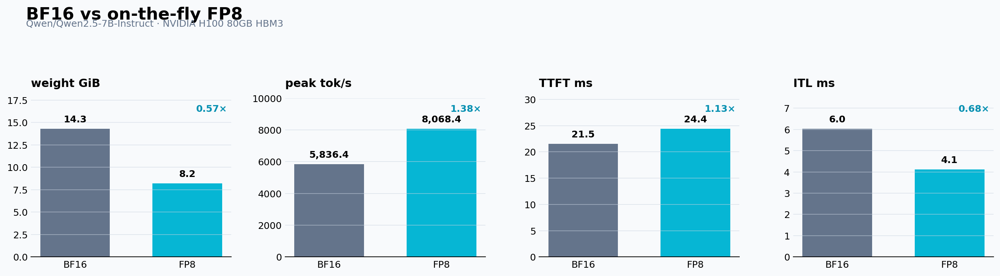
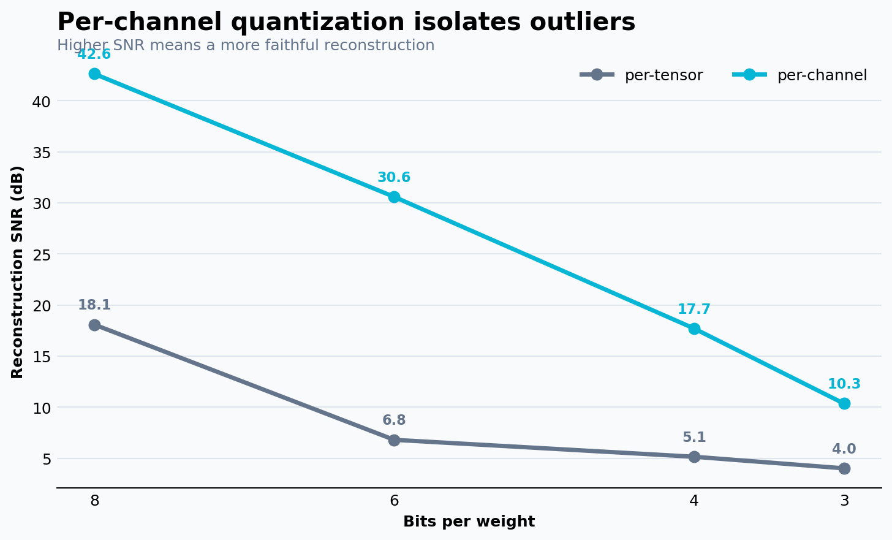

<div align="center">

# Quantization & LLM Serving Benchmark

**From first-principles quantization to BF16 vs FP8 serving on an NVIDIA H100**

[](https://www.python.org/)
[](https://pytorch.org/)
[](https://github.com/vllm-project/vllm)
[](https://www.nvidia.com/en-us/data-center/h100/)
[](LICENSE)

[Notebook](quant_serving.ipynb) · [Assignment](TASK.md) · [Q1 results](results/q1/q1_results.json) · [Q2 results](results/q2/comparison.json)

</div>

## Overview

This project connects quantization theory to measured LLM-serving performance:

1. **Quantization from first principles** — implements symmetric/asymmetric and per-tensor/per-channel fake quantization, then measures reconstruction error and memory trade-offs.
2. **Production-style serving benchmark** — serves the same dense 7B model in BF16 and on-the-fly FP8 with [vLLM](https://github.com/vllm-project/vllm), drives both OpenAI-compatible endpoints with [GuideLLM](https://github.com/vllm-project/guidellm), and compares memory, throughput, TTFT, and ITL.

The complete experiment is captured in one executed notebook and can be reproduced on a fresh Nebius H100 VM with one command.

## Headline results

The serving experiment used **Qwen/Qwen2.5-7B-Instruct** on one **NVIDIA H100 80 GB HBM3**. GuideLLM generated synthetic requests with 512 prompt tokens and 256 output tokens. Each synchronous and throughput profile ran for 30 seconds; throughput used a maximum concurrency of 64.

| Metric | BF16 | FP8 | Change |
|---|---:|---:|---:|
| Weight allocation | 14.29 GiB | 8.20 GiB | **1.74× smaller** |
| Peak output throughput | 5,836 tok/s | 8,068 tok/s | **1.38× higher** |
| Median inter-token latency | 6.03 ms | 4.11 ms | **32% lower** |
| Median request latency | 1.56 s | 1.07 s | **31% lower** |
| Median time to first token | 21.51 ms | 24.38 ms | **13% higher** |

> These are measurements from this project run, not universal model or hardware guarantees. Results depend on the model, vLLM version, request shape, concurrency, and GPU configuration.



### What the measurements show

- **FP8 reduced the loaded model allocation by 42.6%.** The observed 1.74× reduction is below the ideal 2× weight-only estimate because runtime allocations include more than packed weight values.
- **Decode benefited more than prefill.** Median ITL fell to 0.68× BF16, consistent with autoregressive decode repeatedly moving weights through memory. TTFT increased slightly because prefill is more compute-heavy and conversion/kernel overheads can offset lower weight traffic.
- **Peak throughput did not scale linearly with weight compression.** Attention, KV-cache traffic, activations, scheduling, and non-quantized kernels remain part of the saturated serving path.
- **Performance is not quality.** The benchmark measures serving behavior; a representative accuracy evaluation is still required before deploying an uncalibrated FP8 configuration.

## Quantization from first principles

Q1 quantizes a 256×1024 weight matrix containing outlier columns. At 8 bits, per-channel quantization reached **42.65 dB SNR**, compared with **18.09 dB** for per-tensor quantization. This illustrates why a single scale can waste resolution when a few outliers stretch the tensor-wide range. PyTorch's own quantization guidance likewise distinguishes per-tensor and per-channel granularity and notes the accuracy advantages of per-channel weight quantization in high-variance cases.



| Format | Theoretical 7B weight memory | Reduction vs BF16/FP16 |
|---|---:|---:|
| BF16 / FP16 | 13.04 GiB | 1× |
| FP8 | 6.52 GiB | 2× |
| INT4 | 3.26 GiB | 4× |

## Why this stack

- **[vLLM](https://github.com/vllm-project/vllm)** provides an OpenAI-compatible server, continuous batching, optimized attention kernels, CUDA graph execution, and native FP8 support.
- **[GuideLLM](https://github.com/vllm-project/guidellm)** produces LLM-specific latency and throughput statistics, including TTFT, ITL, request latency, and exportable JSON/HTML reports.
- **[NVIDIA H100](https://www.nvidia.com/en-us/data-center/h100/)** exposes Hopper Transformer Engine support for FP8, making it the appropriate platform for the on-the-fly FP8 comparison.
- **[Nebius Compute](https://docs.nebius.com/compute/quickstart)** provides the remotely provisioned GPU VM used by the automated workflow.

## Reproduce the complete experiment

### Prerequisites

- A Nebius account, authenticated [Nebius CLI](https://docs.nebius.com/cli/reference/compute/instance/create), project, and H100 quota.
- `bash`, `jq`, `ssh`, `ssh-keyscan`, and `rsync` on the workstation.
- An Ed25519 SSH key at `~/.ssh/id_ed25519`, or custom key paths supplied through environment variables.
- A Hugging Face token for reliable model downloads.

Create the local secret file:

```bash
cp .env.example .env
# Set HF_TOKEN in .env. Never commit this file.
```

Run the full remote workflow:

```bash
./run-full-project.sh
```

The script:

```text
create H100 VM → wait for SSH → upload project → create remote .venv
       → install requirements → validate CUDA → execute notebook in place
       → download notebook/results → stop VM
```

Defaults target the assignment's Nebius project and subnet. They can be overridden without editing the script:

```bash
NEBIUS_PROFILE=my-profile \
NEBIUS_PROJECT_ID=my-project-id \
NEBIUS_SUBNET_ID=my-subnet-id \
SSH_PRIVATE_KEY=/path/to/key \
./run-full-project.sh
```

The cleanup trap stops the created VM on success, failure, or interruption. **Stopping is not deletion:** the VM and its managed disk remain in Nebius and may continue to incur storage charges. Delete them in the console when they are no longer needed.

## Project structure

```text
.
├── quant_serving.ipynb         # Implementations, benchmark, outputs, writeup
├── run-full-project.sh         # End-to-end Nebius H100 automation
├── requirements.txt            # Reproducible Python environment
├── TASK.md                     # Original assignment specification
├── results/
│   ├── q1/                     # Accuracy table and SNR plot
│   └── q2/                     # GuideLLM reports, logs, plot, comparison JSON
├── .env.example                # Safe environment template
└── LICENSE                     # MIT
```

## Result artifacts

| Artifact | Purpose |
|---|---|
| [`q1_results.json`](results/q1/q1_results.json) | Per-bit reconstruction metrics and theoretical 7B memory table |
| [`snr_vs_bits.png`](results/q1/snr_vs_bits.png) | Per-tensor vs per-channel reconstruction quality |
| [`comparison.json`](results/q2/comparison.json) | Compact BF16/FP8 benchmark summary |
| [`bf16_vs_fp8.png`](results/q2/bf16_vs_fp8.png) | Visual comparison of memory, throughput, TTFT, and ITL |
| [`bench_*.json`](results/q2/) | Machine-readable GuideLLM reports |
| [`bench_*.html`](results/q2/) | Interactive GuideLLM reports |
| [`vllm_*.log`](results/q2/) | Server startup and model-allocation evidence |

## Methodology notes

- BF16 and FP8 use the **same model ID**, context length, GPU-memory-utilization setting, prompt/output shape, and benchmark duration.
- FP8 is applied by vLLM at model load with `--quantization fp8`; no pre-quantized checkpoint is substituted.
- Synchronous traffic is used for clean single-stream latency; the throughput profile applies concurrent load to estimate saturation throughput.
- Weight allocation is parsed from vLLM's model-loading log rather than `nvidia-smi`, because vLLM reserves additional GPU memory for the KV cache and runtime.
- The notebook preserves all cell outputs, while raw JSON/HTML reports remain available for deeper inspection.

## References

- [vLLM repository and feature overview](https://github.com/vllm-project/vllm)
- [GuideLLM repository, metrics, profiles, and reports](https://github.com/vllm-project/guidellm)
- [Nebius Compute VM quickstart](https://docs.nebius.com/compute/quickstart)
- [Nebius CLI: create a compute instance](https://docs.nebius.com/cli/reference/compute/instance/create)
- [NVIDIA H100 Tensor Core GPU](https://www.nvidia.com/en-us/data-center/h100/)
- [NVIDIA Transformer Engine FP8 primer](https://docs.nvidia.com/deeplearning/transformer-engine-releases/release-2.8/user-guide/examples/fp8_primer.html)
- [PyTorch: Quantization in practice](https://pytorch.org/blog/quantization-in-practice/)

## License

Released under the [MIT License](LICENSE).
